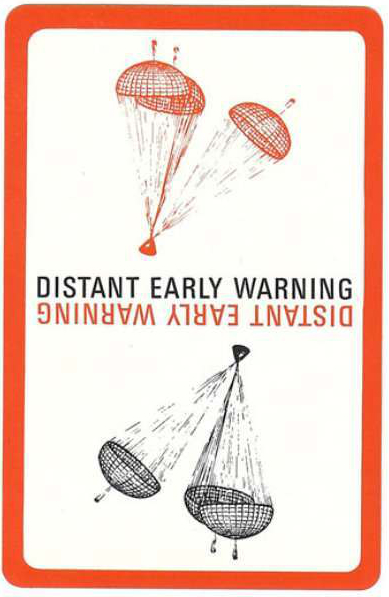

<html lang="en">
<head>
    <meta charset="UTF-8">
    <meta name="viewport" content="width=device-width, initial-scale=1.0">
    <title>Daily Comparison</title>
    
</head>
<body>

    

        

            

                
            

            
One Marshall McLuhan card per day

        

        

            

                
            

            
Inspired by <a href="https://www.weirdstudies.com/112">episode 112 of Weird Studies</a>

        

    

    

</body> 
</html>
