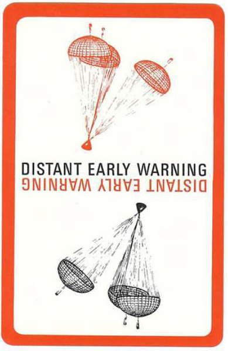

<html lang="en">
<head>
    <meta charset="UTF-8">
    <meta name="viewport" content="width=device-width, initial-scale=1.0">
    <title>Daily Comparison</title>
    
</head>
<body>

    <!-- ROW 1: Contains exactly 2 cards -->
    

        

            
        

        

            
        

    

    <!-- TEXT AREA BELOW ROW 1 -->
    

        One Marshall McLuhan card per day. 
        Inspired by <a href="https://www.weirdstudies.com/112" target="_blank">episode 112 of Weird Studies</a>
    

    <!-- MIDDLE TITLE HEADER -->
    
Lenormand Deck Cards of the Day

    <!-- ROW 2: Contains exactly 3 cards -->
    

        

            
        

        

            
        

        

            
        

    

    <!-- POPUP ZOOM LIGHTBOX -->
    

        
    

    
</body> 
</html>
